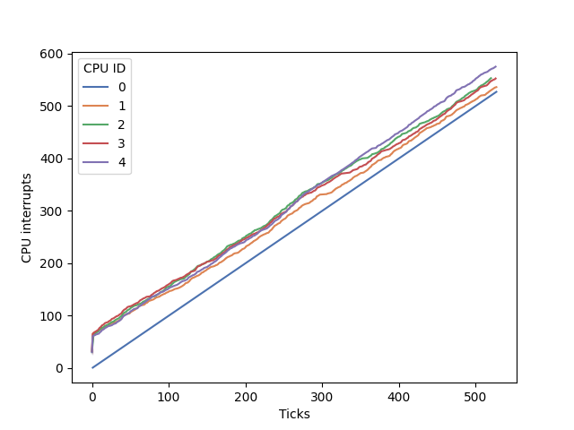
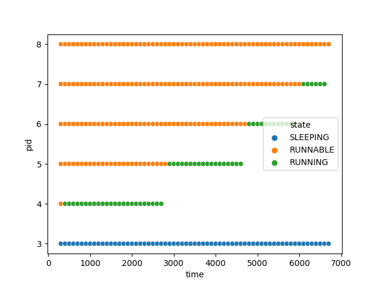
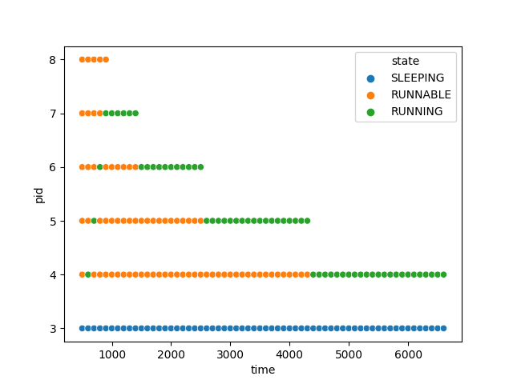
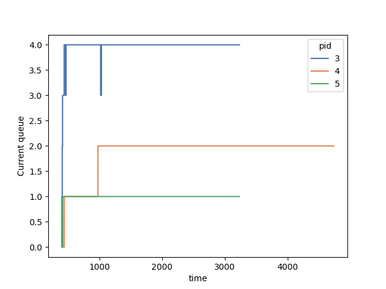

# Enhancing xv6 OS
#### Siddhant Jain 2019111038

## Compile instructions

- `make clean; make qemu-nox SCHEDULER=RR/FCFS/MLFQ/PBS`
- Optionally add another argument `LOGS=1` to print additional info about processes for plotting purposes

## New variables added to `struct proc`:
-  `uint ctime;` Create time
-  `uint rtime;` Running time (Time taken on CPU)
-  `uint etime;` End time
-  `uint wtime;` Wait time (Time spent in RUNNABLE state)
-  `uint qwtime;` Time spent in RUNNABLE state in the current queue; get reset after it is picked by the scheduler, for aging in MLFQ
-  `uint stime;` Time spent in sleep state
-  `uint qticks[5];` Time spent in RUNNING state in each queue; does not get reset
-  `int ts_rtime;` Time running since last pick, used to demote process to lower priority queue in MLFQ
-  `int time_slice;` Time slice value in current queue
-  `int to_add;` Set to "1" in allocproc, tell the scheduler to add this process to the highest priority queue. Set to 0 after process has been added to queue
-  `int cur_q;` Current queue
-  `int n_run;` Number of times picked by the CPU
-  `int priority;` Priority of process, default 60

## `int waitx(int *wtime, int *rtime)`
- System call, defined in proc.c
- Similar to wait(), but sets:
    - `*wtime = p->wtime;`
    - `*rtime = p->rtime;`

## `void ps(void)`
- Defined in proc.c
- ## nrun > rtime Causes
    - Process goes to sleep or finishes execution before first rtime can be incremented
    - In case of multiple CPUS, since only CPUID=0 is responsible for incrementing ticks and rtimes of running processes it is possible for other CPU traps to be called multiple times before a single tick is updated. Can be demonstrated using this graph:
    

## Scheduling Algorithms

## Comparision
Running `time benchmark 1` on different schedulers with *1 CPU*. and number_of_processes=5.

|       | Rtime | Wtime | Total time |
|-------|-------|-------|------------|
| RR    |    4   |    1   |      12560      |
| FCFS  |    6   |    1   |      13007      |
| PBS   |    5   |    1   |      12121      |
| MLFQ  |    7   |    0   |      11967      |

MLFQ and PBS both perform better as:
- In case of __PBS__, a higher priority was set for more IO bound processes using set_priority system call
- In case of __MLFQ__, the scheduler is only called after either 1/2/4/8/16 depending on the current queue of the RUNNING process. Hence saving time in context switching and picking a process to run.
- __FCFS__ performs the worst as it tries to complete the processes in order of their create time and according to how the benchmark is defined, the process with lowest ctime is the most CPU bound.

 
 
 
 

## FCFS (First Come First Serve)
Y-axis is the PID;
X-axis is ticks.

                  

## RR (Round Robin)
Y-axis is the PID;
X-axis is ticks.

                    

## PBS (Round Robin)
Y-axis is the PID;
X-axis is ticks.

                    

## MLFQ

- MLFQ Scheduling can be exploited by a process in the following manner:
    - Assume 2 processes which have 2000 ticks of IO time and also same CPU time requirements (100000000 multiplications).
    - Process 3 is the parent process which creates both processes
    - process 4 takes 100 IO turns of length 20 ticks
    - process 5 takes 2000 IO turns of length 1 ticks
    - It can be seen from the graph that process 5 completes considerably faster than process 4 

